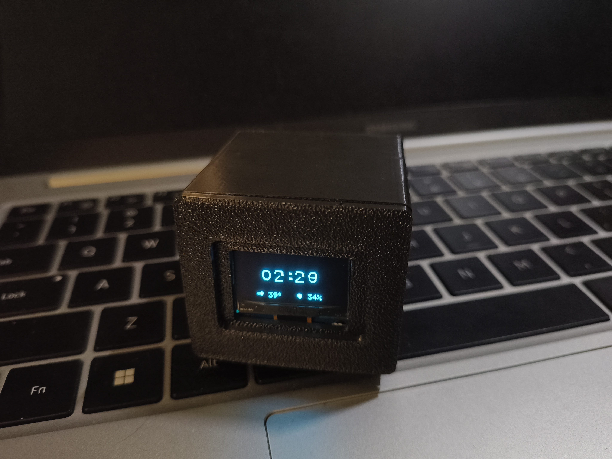
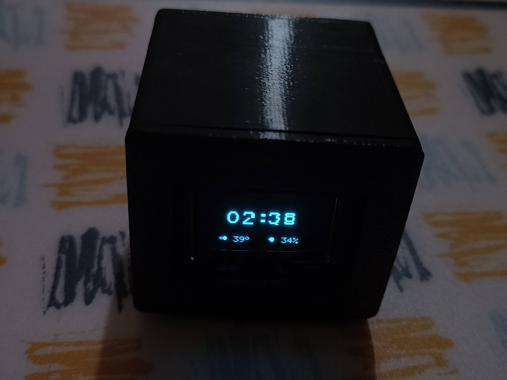

  

<h1 align="center">DigiClock — ATtiny85 OLED Desk Clock</h1>

  
  
  
  
  
  

  A minimal, battery-powered real-time clock with temperature & humidity display, 
  built entirely on a Digispark ATtiny85 board with only 8KB of flash memory. 
  Housed in a custom 3D-printed enclosure.

---

## 📸 The Build

  
  &nbsp;&nbsp;
  

---

## ✨ Features

- **Real-Time Clock** — Hours, minutes & seconds via DS3231 RTC (I²C)
- **Blinking Colon** — Synced to even/odd seconds for accurate 1Hz blink
- **Temperature Display** — DHT11 reading with 70% scaling calibration
- **Humidity Display** — Relative humidity percentage
- **Smart Refresh** — Only redraws changed digits to eliminate flicker
- **Custom Pixel Fonts** — Hand-crafted 12×16 large digits, 5×8 small font, stored in PROGMEM
- **One-Button Time Set** — Single button adds 10 minutes per press with hold-repeat
- **Battery Powered** — 400mAh Li-Ion cell with TP4056 USB-C charging
- **3D-Printed Enclosure** — Print-ready STL files included
- **Tiny Footprint** — Entire firmware fits in ~6KB flash

---

## 🔌 Pin Diagram

  

---

## 🧩 Parts List

<table>
  <tr>
    <th align="center">#</th>
    <th align="left">Component</th>
    <th align="left">Specification</th>
    <th align="center">Qty</th>
  </tr>
  <tr>
    <td align="center">1</td>
    <td>Digispark Board</td>
    <td>ATtiny85 — Micro USB</td>
    <td align="center">1</td>
  </tr>
  <tr>
    <td align="center">2</td>
    <td>OLED Display</td>
    <td>SSD1306 128×64 I²C — 0.96"</td>
    <td align="center">1</td>
  </tr>
  <tr>
    <td align="center">3</td>
    <td>RTC Module</td>
    <td>DS3231 I²C — CR2032 backup</td>
    <td align="center">1</td>
  </tr>
  <tr>
    <td align="center">4</td>
    <td>Temp & Humidity Sensor</td>
    <td>DHT11</td>
    <td align="center">1</td>
  </tr>
  <tr>
    <td align="center">5</td>
    <td>Li-Ion Battery</td>
    <td>3.7V 400mAh</td>
    <td align="center">1</td>
  </tr>
  <tr>
    <td align="center">6</td>
    <td>Charging Module</td>
    <td>TP4056 — USB-C / Micro USB</td>
    <td align="center">1</td>
  </tr>
  <tr>
    <td align="center">7</td>
    <td>Tactile Push Button</td>
    <td>6×6mm momentary</td>
    <td align="center">1</td>
  </tr>
  <tr>
    <td align="center">8</td>
    <td>Connecting Wires</td>
    <td>Dupont / 28AWG silicone</td>
    <td align="center">—</td>
  </tr>
  <tr>
    <td align="center">9</td>
    <td>Enclosure</td>
    <td>3D Printed — STL files included</td>
    <td align="center">1</td>
  </tr>
</table>

---

## 🔗 Connections Summary

<table>
  <tr>
    <th align="center">ATtiny85 Pin</th>
    <th align="left">Connects To</th>
    <th align="center">Protocol</th>
  </tr>
  <tr>
    <td align="center">P0 (SDA)</td>
    <td>OLED SDA &nbsp;•&nbsp; DS3231 SDA</td>
    <td align="center">I²C</td>
  </tr>
  <tr>
    <td align="center">P2 (SCL)</td>
    <td>OLED SCL &nbsp;•&nbsp; DS3231 SCL</td>
    <td align="center">I²C</td>
  </tr>
  <tr>
    <td align="center">P3</td>
    <td>Push Button → GND</td>
    <td align="center">Digital Input</td>
  </tr>
  <tr>
    <td align="center">P4</td>
    <td>DHT11 Data Pin</td>
    <td align="center">One-Wire</td>
  </tr>
  <tr>
    <td align="center">5V</td>
    <td>TP4056 OUT+ → VCC Rail</td>
    <td align="center">Power</td>
  </tr>
  <tr>
    <td align="center">GND</td>
    <td>Common Ground</td>
    <td align="center">Power</td>
  </tr>
</table>

 

> **Power Chain:** Li-Ion Battery → TP4056 → Digispark 5V pin (regulated onboard)

---

## ⚡ How It Works

<pre>
┌─────────────┐    I²C     ┌──────────┐
│   DS3231    │◄──────────►│          │
│    RTC      │            │ ATtiny85 │──── P4 ──── DHT11
└─────────────┘            │ Digispark│
                           │          │──── P3 ──── Button
┌─────────────┐    I²C     │          │
│  SSD1306    │◄──────────►│          │
│  128×64     │            └──────────┘
└─────────────┘                 │
                           ┌────┴────┐
                           │ TP4056  │
                           │ Charger │
                           └────┬────┘
                           ┌────┴────┐
                           │ 400mAh  │
                           │ Li-Ion  │
                           └─────────┘
</pre>

### Clock Update Cycle
1. **Every 1 second** → Read DS3231 via I²C → update digits & colon
2. **Every 3 seconds** → Read DHT11 (interrupts disabled during read) → update temp/humidity
3. **On button press** → Add 10 minutes → write back to DS3231

### Smart Refresh System
Instead of redrawing the entire screen every second, the firmware tracks the last displayed value of every element. Only pixels that actually changed get rewritten — this eliminates flicker and reduces I²C bus load.

---

## 🖨️ 3D-Printed Enclosure

Print-ready files are available in the [`3d_files/`](3d_files/) folder.

### Print Settings (Recommended)

<table>
  <tr>
    <th align="left">Parameter</th>
    <th align="left">Value</th>
  </tr>
  <tr>
    <td>Layer Height</td>
    <td>0.2mm</td>
  </tr>
  <tr>
    <td>Infill</td>
    <td>20%</td>
  </tr>
  <tr>
    <td>Material</td>
    <td>PLA / PETG</td>
  </tr>
  <tr>
    <td>Supports</td>
    <td>As needed per model</td>
  </tr>
  <tr>
    <td>Wall Thickness</td>
    <td>1.2mm (3 walls)</td>
  </tr>
</table>

 

> **Tip:** Print a test fit first before final assembly. Tolerances may vary between printers.

---

## 🛠️ Build & Upload

### Prerequisites

<table>
  <tr>
    <th align="left">Software</th>
    <th align="left">Link</th>
  </tr>
  <tr>
    <td>Arduino IDE</td>
    <td><a href="https://www.arduino.cc/en/software">arduino.cc/en/software</a></td>
  </tr>
  <tr>
    <td>Digistump Board Package</td>
    <td><a href="https://github.com/digistump/DigistumpArduino">github.com/digistump/DigistumpArduino</a></td>
  </tr>
</table>

### Step 1 — Install Digispark Board Support

1. Open Arduino IDE → **File** → **Preferences**
2. In **Additional Board Manager URLs**, add:

<pre>
http://digistump.com/package_digistump_index.json
</pre>

3. Go to **Tools** → **Board** → **Board Manager**
4. Search `Digistump AVR` → Install
5. Select **Tools** → **Board** → **Digispark (Default - 16.5mhz)**

### Step 2 — Install Required Library

1. Go to **Sketch** → **Include Library** → **Manage Libraries**
2. Search & install: `TinyWireM`

> **Note:** No other libraries needed — the OLED driver, fonts, and DHT reader are all built into the sketch.

### Step 3 — Upload

1. Open `DigiClock.ino` in Arduino IDE
2. Click **Upload**
3. When the IDE says **"Plug in device now..."**, connect your Digispark via USB
4. Upload completes automatically via the Micronucleus bootloader

> ⚠️ **Do NOT plug in the Digispark before clicking Upload.** The bootloader only listens for 5 seconds on power-up.

---

## 📐 Display Layout

<pre>
     Column:  0       30                              110  127
              ┌────────────────────────────────────────────┐
    Page 0    │                                            │
    Page 1    │        ██  ██       ██  ██                 │
    Page 2    │        ██  ██  ••   ██  ██    seconds      │
    Page 3    │                                            │
    Page 4    │                        :SS                 │
    Page 5    │                                            │
    Page 6    │                                            │
    Page 7    │  🌡  24°C          💧  55%                │
              └────────────────────────────────────────────┘
</pre>

---

## 🔧 Calibration Notes

- **Temperature Scaling:** The displayed temperature is `raw × 0.70` (70%). This was calibrated against a reference thermometer for this specific DHT11 unit. Adjust the line `display_temp = (temp * 70) / 100;` in the code to match your sensor.
- **Button Behavior:** Each press adds +10 minutes. Hold for auto-increment. There's no separate hour/minute mode to keep the code minimal.

---

## 📁 Repository Structure

<pre>
DigiClock/
├── README.md               ← You are here
├── LICENSE                 ← MIT License
├── DigiClock.ino           ← Main firmware (single file)
├── images/
│   ├── logo.png            ← Project logo
│   ├── pin_diagram.png     ← Wiring diagram
│   ├── clock_photo_1.jpg   ← Build photo
│   └── clock_photo_2.jpg   ← Build photo
└── 3d_files/
    └── enclosure.stl       ← 3D printable case
</pre>

---

## 📝 Known Limitations

- DHT11 accuracy is ±2°C / ±5% RH — it's not a precision instrument
- The 70% temperature scaling is specific to my unit; yours may differ
- Digispark USB pins (P3/P4) are shared with the sensor and button — **unplug USB before normal operation** to avoid interference
- No AM/PM indicator — runs in 24-hour format only
- DS3231 backup battery (CR2032) keeps time when main power is off

---

## 📜 License

This project is licensed under the **MIT License** — see the [LICENSE](LICENSE) file for details.

---

  Built with ☕ and an 8-bit chip that has less RAM than this README.

